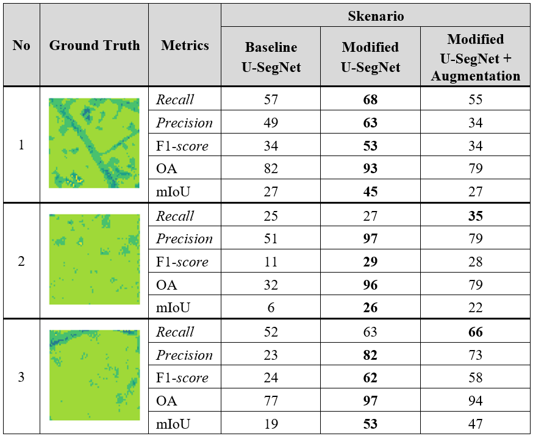

# Semantic segmentation of Sen-2 LULC dataset using modified U-SegNet

## Abstract

 
  Environmental monitoring, urban planning, and resource management are forms of implementing SDG 15 (Sustainable Development Goals), which focus on protecting, restoring, and promoting the sustainable and efficient use of forests and terrestrial ecosystems. However, these efforts are hindered by the increasing phenomenon of urbanization, which causes damage to natural ecosystems. To conduct regular monitoring, it is necessary to have automated land use and land cover (LULC) mapping to prevent ecosystem damage. Nevertheless, the complex landscape and the subtle transitions between various LULC classes pose significant challenges for optimal segmentation. This research proposes a modification of the U-SegNet architecture, which combines two widely used deep learning segmentation architectures, SegNet and U-Net, to improve LULC mapping. This architecture features an encoder-decoder structure that integrates pooling indices (from [SegNet](https://arxiv.org/pdf/1511.00561v3) and skip connections (from [U-Net](https://arxiv.org/pdf/1505.04597) to generate and transmit spatial image information. This modified architecture was inspired by [U-SegNet: fully convolutional neural network based automated brain tissue segmentation tool](https://arxiv.org/pdf/1806.04429)

  

<!--  -->

## Dataset
The original dataset is from [Sen-2 LULC](https://www.sciencedirect.com/science/article/pii/S2352340923007953). The "Sen-2 LULC Dataset" is a collection of 213,750 pre-processed 10 m resolution images representing 7 distinct classes of Land Use Land Cover. The 7 classes are water, Dense forest, Sparse forest, Barren land, Built up, Agriculture land and Fallow land. Multiple classes are present in the  single image of the dataset. 

## Result
The evaluation contains three scenarios: Baseline U-SegNet, Modified U-SegNet, Modified U-SegNet + Augmentation. The configurations used to train these scenarios:
* 64 Batch Size
* SGD Optimizer (baseline) and Adam Optimizer (modified)
* 0,001 Learning Rate
* Early Stopping
* ReduceLROnPlateau
* 0.1 Factor
* 2 Patience
* Categorical Crossentropy
* 50 Epochs

| Metrics | Baseline U-SegNet | Modified U-SegNet | Modified U-SegNet + Augmentation |
| ---------------- | ----------------- | ----------------- | -------------------------------- |
| Recall | 34 | **53** | 45 |
| Precision | 44 | **57** | 50 |
| Avg. F1 | 36 | **55** | 46 |
| Overall Accuracy | 71 | **82** | 74 |
| mIoU | 26 | **42** | 33 |

### Segmentation Map
<table border="0">
 <tr>
    <td><b style="font-size:30 px">Complex features</b></td>
    <td><b style="font-size:30 px">Dominated by one feature</b></td>
 </tr>
 <tr>
    <td></td>
    <td></td>
 </tr>
</table>

### Demo
To implement Modified U-SegNet, please use `testing.ipynb` file that I provided.
